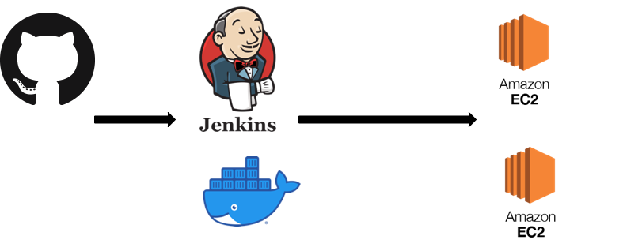

Mogaco
=============
모여서 같이 코딩을 돕는 모임 애플리케이션입니다. 
백엔드 REST API와 React를 사용하는 프론트로 나뉘어져있습니다.  
프로젝트 개발 회고를 작성하고 있습니다 
[링크](https://itcoin.tistory.com/category/%ED%9A%8C%EA%B3%A0%20%EB%AA%A8%EC%9D%8C/Project)

## 프로젝트의 주요 관심사
- 테스트 코드 작성
- 프론트, 백엔드 구분하여 개발 
  
<b>코드 컨벤션</b> 
- 백엔드 개발시 Google code Style 플러그인을 적용
- 프론트 개발시 Eslint 적용 
- 링크 https://google.github.io/styleguide/javaguide.html

### 용어사전
[용어사전](https://github.com/CodeSoom/project-spring-1-etff/wiki/%EC%9A%A9%EC%96%B4%EC%82%AC%EC%A0%84)

### 일정관리
[트렐로](https://trello.com/b/Dslv99ST/mogaco)

### 테스트
- Junit5을 이용한 테스트
- Spring REST DOC 작성

## 사용 기술 및 환경
Spring Boot, JPA, H2 Database, React, Redux, Redux-Saga, NGINX, MySQL
 
- Spring Boot는 이미 많은 회사에서 백엔드 기술로 사용되고 있습니다. 
  Spring 에 비해 간단한 설정으로 웹 개발을 진행할 수 있습니다.
- JPA는 빠른 생산성이 장점입니다. 객체와 DB와 맵핑을 자동으로 해주어 개발 편의성이 높습니다.
- React은 현재 Frontend에서 많이 쓰이는 개발 환경입니다. 컨포넌트 개발 방식으로 재활용성이 높고, SPA에서 좋은 성능을 보여줍니다.
- Redux Saga 프론트 환경에서 상태 관리 라이브러리입니다. Front에서 상태(state) 관리를 위해 사용했습니다.   

### CI
- AWS ec2에 Jenkins 설치

### CD
- Jenkins 빌드, 테스트 이후 dockerhub에 저장
- 배포된 docker image를 application 서버에 배포

## 화면 설계
https://ovenapp.io/view/GzVdPmkgMyAk6VUQbIvyQQA1PqqB0J7K/

## 모델링
[모델링](https://github.com/CodeSoom/project-spring-1-etff/wiki/%EB%AA%A8%EB%8D%B8%EB%A7%81)
